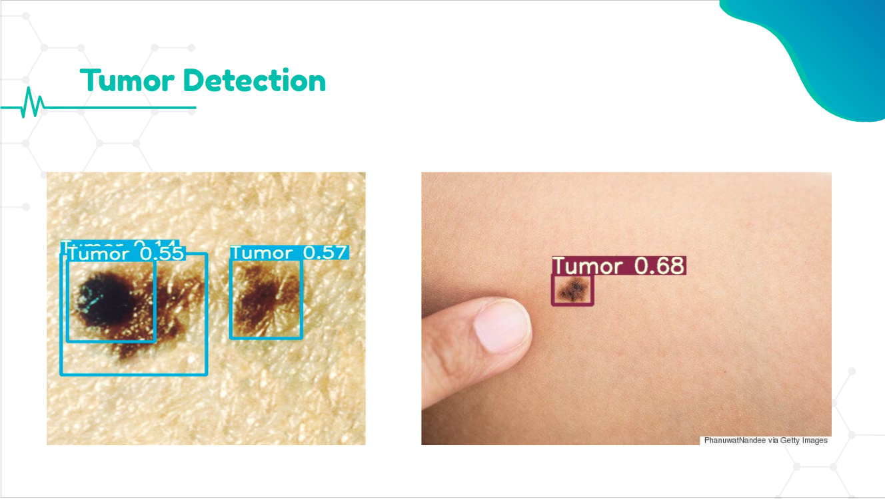
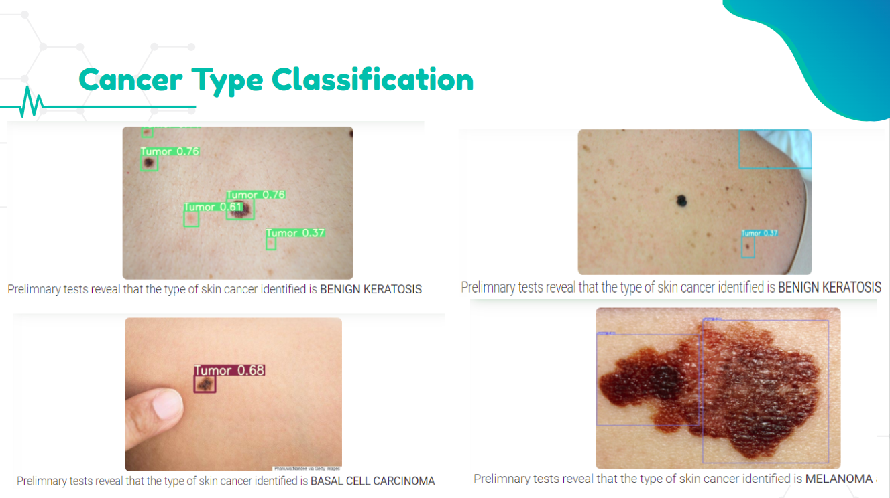

# EPIDERMA Skin Cancer Detection Portal
<p align="center">
  
</p>

 We propose a novel method of primary skin cancer prevention that integrates the following features into a cloud based web framework which optimizes the process of cancer detection

## Objectives 
 * Design an interactive patient and doctor portal
 * Provide an e-report generation system using Deep Learning
 * Assist the doctors in Skin Cancer diagnosis and imaging tasks
 * Equip the portal with a backend doctor database and a location & filter specific doctor recommendation portal
 * Add a symptom and disease tagging support system based on NLP

## Features 
### 1. Skin Cancer Probability Prediction
* Our classification system classifies the skin cancer tumor diseases as Positive and the regular skin diseases like Eczema, Moles, Acne, Warts, etc., along with the non-diseased images as Negative and also returns the probability of the same.
* The model architecture used for the same is an ensemble of ResNet34 & ResNet50.
<p align="center">
  
</p>

### 2. Tumor Localization

* To ensure that the future diagnosis is robust, we propose a tumor detection system that would make a bounding box around the area in an image where the tumor is located, if any.
* Tumor detection filters out the negative images and further makes the diagnosis process even more simplified for the medical practitioner.
<p align="center">
  
</p>

### 3. Cancer Type Classification

* Each type of Cancer has a different course of treatment and remedial strategies. Thus, classification of Cancer type using transfer learning can help both the patient and the doctor during the course of treatment. 

* Different types of Skin Cancer have different characteristics and treatment strategies. This is a multi-class classification problem with 7 classes namely:
  - Actinic keratosis
  - Basal cell carcinoma
  - Benign keratosis
  - Dermatofibroma
  - Melanoma
  - Melanocytic nevus
  - Vascular lesion

* We use a combination of 3 ensembled transfer learning models that would give the type of Skin Cancer for a Positively diagnosed image.

<p align="center">
  
</p>

### 4. DERMATOS: Disease Symptom Tagging Bot

* Instead of using external APIs, we build a basic rule based chatbot.
* This comprises of a symptom disease tagging bot that would classify the diseases into several skin diseases. 
<p align="center">
  
</p>

### 5. Report Generation System

* A cumulative report would be generated that would contain the inferences returned by the above mentioned models i.e. Skin Cancer Probability, Type of Skin Cancer, Image of Detected Tumor etc along with the user details.
* This report file could be downloaded by the user. This report would come into great use for the doctor who would have a threshold result with him as a reference to base his treatment upon for each referred patient by him. 
<p align="center">
  
</p>

### 6. Blogs

* There is a dedicated portal for the users and doctors both to write and share blogs.
* The blogs have additional support for likes, dislikes and comments.

<p align="center">
  
</p>

## A Machine can never replace a human
 * Even though our predictions are really accurate(>95%),we need to be really careful while working with Machine Learning in the medical domain as our predictions are directly affecting someone’s life.
 * The effect of discrepancies is much larger in the medical domain than others. 
 * Thus, we just generate a preliminary report based on initial scans that can be referred by a doctor to ease the diagnosis process.

## Tech Stack
 - Flask
 - Mysql
 - HTML,CSS,JS 
 - JQuery,AJAX
 - PyTorch/FastAI
 - Google Cloud Platform
 - Apache2 Server
 - Tensorflow/Keras


## Installation

OS X & Linux:

```sh
 git clone https://github.com/namantuli18/Skin-Cancer-Detection.git SCD
 cd SCD
 virtualenv venv
 source venv/bin/activate
 pip3 install -r requirements.txt
 python3 app.py
```

Windows (Not Recommended as Pytorch has problems in installing):

```sh
git clone https://github.com/namantuli18/Skin-Cancer-Detection.git SCD
cd SCD
virtualenv venv
./venv/Scripts/activate
pip3 install -r requirements.txt
python3 app.py
```

## Meta

> Naman Tuli – Email: namantuli2000@gmail.com -
[GitHub](https://github.com/namantuli18)

> Prakhar Singh – Email: prakharsingh13@gmail.com -
[GitHub](https://github.com/prakharsingh1312)

## Contributing

>1. Fork it (<https://github.com/namantuli18/Epiderma.git>)
>2. Create your feature branch (`git checkout -b feature/fooBar`)
>3. Commit your changes (`git commit -am 'Add some fooBar'`)
>4. Push to the branch (`git push origin feature/fooBar`)
>5. Create a new Pull Request

<!-- Markdown link & img dfn's -->
[npm-image]: https://img.shields.io/npm/v/datadog-metrics.svg?style=flat-square
[npm-url]: https://npmjs.org/package/datadog-metrics
[npm-downloads]: https://img.shields.io/npm/dm/datadog-metrics.svg?style=flat-square
[travis-image]: https://img.shields.io/travis/dbader/node-datadog-metrics/master.svg?style=flat-square
[travis-url]: https://travis-ci.org/dbader/node-datadog-metrics
[wiki]: https://github.com/yourname/yourproject/wiki
